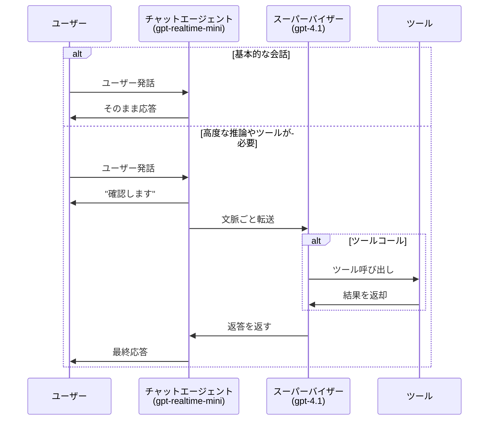
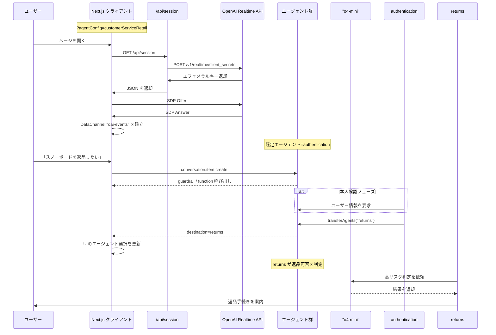

# Realtime API エージェントデモ

OpenAI Realtime API と Agents SDK を組み合わせた音声／テキストエージェントの日本語向けデモです。複数エージェントの切り替え、イベントログ、モデレーション結果などをブラウザ上で追跡できます。

## TL;DR
- Realtime API と @openai/agents@0.3.0 を使ったマルチエージェントのリファレンス実装
- Next.js 15 + React 19 + TypeScript で構築し、UIはすべて日本語化済み
- 「チャット・スーパーバイザー」「シーケンシャル・ハンドオフ」の2パターンがそのまま試せる

## プロジェクト概要
- Web クライアントは `src/app` にあり、Transcript／イベントログ／ツールバーを個別コンポーネントとして分離
- エージェント定義は `src/app/agentConfigs/` 以下にまとまっており、SDK へそのまま渡せる JSON 互換構造
- 共通の UI 文言は `src/app/i18n/` で管理し、インターフェイス駆動で参照
- Guardrail(モデレーション)結果や handoff を Transcript にブレッドクラムとして追加し、履歴を簡単に追跡可能

## 2025年11月の主な更新
- 依存パッケージを `@openai/agents@0.3.0` / `openai@6.8.1` / `gpt-realtime` 系 GA に合わせ、SIP/PSTN・MCP コネクタ・ルーター連携を利用可能に
- `session.modalities` など GA 仕様の音声スキーマに追従し、Beta→GA 移行のベストプラクティスを反映
- `/api/session` が `POST /v1/realtime/client_secrets` を呼び出すようになり、ブラウザは返却された `value` を再利用して WebRTC 接続

## セットアップ手順
1. Node.js **18.18.0 以上**を用意 (Next.js 15.5 系が要求)。`nvm` での管理を推奨
2. 依存関係をインストール: `npm install`
3. `.env.sample` を `.env` にコピーし、`OPENAI_API_KEY` など必要な環境変数を設定
4. 必要に応じて `NEXT_PUBLIC_REALTIME_*` でモデル／ボイス／文字起こしのデフォルトを上書きし、サーバーとクライアントの設定を同期

## ローカルでの実行
```bash
npm run dev
```
- ブラウザで [http://localhost:3000](http://localhost:3000) を開きます
- 右上の「シナリオ」「エージェント」プルダウンで構成を切り替え可能 (`?agentConfig=` クエリにも対応)
- `Codec` セレクタで Opus/PCMU/PCMA を切り替えると、8kHz 音声品質をブラウザ上で即確認できます

## UIの見どころ
- **ヘッダー**: Realtime API エージェントのロゴと、シナリオ／エージェント選択 UI。クリックでページを再読み込みして最新設定を適用
- **Transcript(会話ログ)**: コピー・音声ダウンロードボタン、ガードレール判定、手動メッセージ送信欄を備えた会話ビュー
- **イベントログ**: 「ログ」パネルで client/server 双方向のイベントを色分け表示し、各行を展開して JSON を確認
- **ボトムツールバー**: 接続／切断、プッシュトゥトーク、ログ表示 ON/OFF、音声再生、コーデック選択などをワンクリックで操作

## Agents SDK について
このプロジェクトは [OpenAI Agents SDK](https://github.com/openai/openai-agents-js) を利用しています。SDK では以下が提供されます。
- エージェントの振る舞い・ツール統合を定義できる統一インターフェイス
- 状態管理・イベント処理・マルチエージェント連携のためのオーケストレーション
- Realtime API とのストリーミング統合、および handoff・ガードレールなど高度なパターンのサンプル

> **補足**: Agents SDK を使わないバージョンが必要な場合は、[without-agents-sdk ブランチ](https://github.com/openai/openai-realtime-agents/tree/without-agents-sdk) を参照してください。

## エージェントパターン
### 1. チャット・スーパーバイザー
`chatSupervisor` 構成では、リアルタイム音声で応答するチャットエージェントと、高知能なスーパーバイザー(`gpt-4.1` など)を組み合わせます。雑談や簡易タスクはチャット側が即時対応し、ツール呼び出しや高精度な回答が必要な場面だけスーパーバイザーへ委譲します。

動画デモ: [https://x.com/noahmacca/status/1927014156152058075](https://x.com/noahmacca/status/1927014156152058075)


*電話番号の取得など軽量な処理はチャットエージェントが担当し、ツールコールを含む回答生成はスーパーバイザーが担当します。*



### 2. シーケンシャル・ハンドオフ (customerServiceRetail)
`customerServiceRetail` では、認証・返品・販売・シミュレート担当といった専門エージェント同士がユーザーを順番に引き継ぎます。意図判定、ステート管理、ガードレールが密接に連携しており、顧客対応を段階的に自動化できます。

主なポイント:
- 認証→返品→人間オペレーター風エージェントなど、目的別のエージェント遷移を `transferAgents` で厳密に制御
- [returns](https://github.com/openai/openai-realtime-agents/blob/60f4effc50a539b19b2f1fa4c38846086b58c295/src/app/agentConfigs/customerServiceRetail/returns.ts#L233) は `o4-mini` へのエスカレーション例を含み、高リスク判断を安全に委譲
- 名前や電話番号のような重要属性はステートマシンで一文字ずつ確認し、音声でも正確に取得



## 開発メモ
- UI 文言は `src/app/i18n/` に集約済みで、将来の多言語化や A/B テストにも対応しやすい構成
- テストは `npm run test` (Vitest) で実行できます。UI テキストが欠落していないかを確認するユニットテストを追加済み
- Lint/型チェックは `npm run lint` / `tsc --noEmit` で実行可能

## 参考リンク
- [OpenAI Agents SDK ドキュメント](https://github.com/openai/openai-agents-js#readme)
- [OpenAI Realtime API ドキュメント](https://platform.openai.com/docs/guides/realtime)
- [without-agents-sdk ブランチ](https://github.com/openai/openai-realtime-agents/tree/without-agents-sdk)

## ライセンス
本リポジトリは [LICENSE](LICENSE) の内容に従います。
